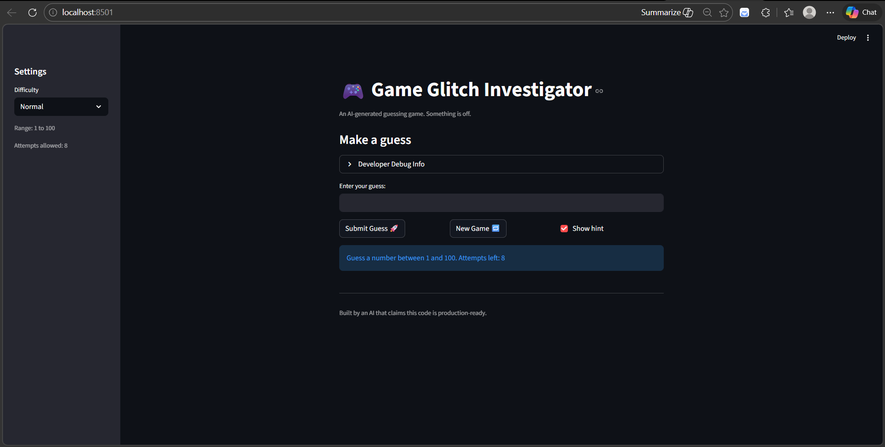
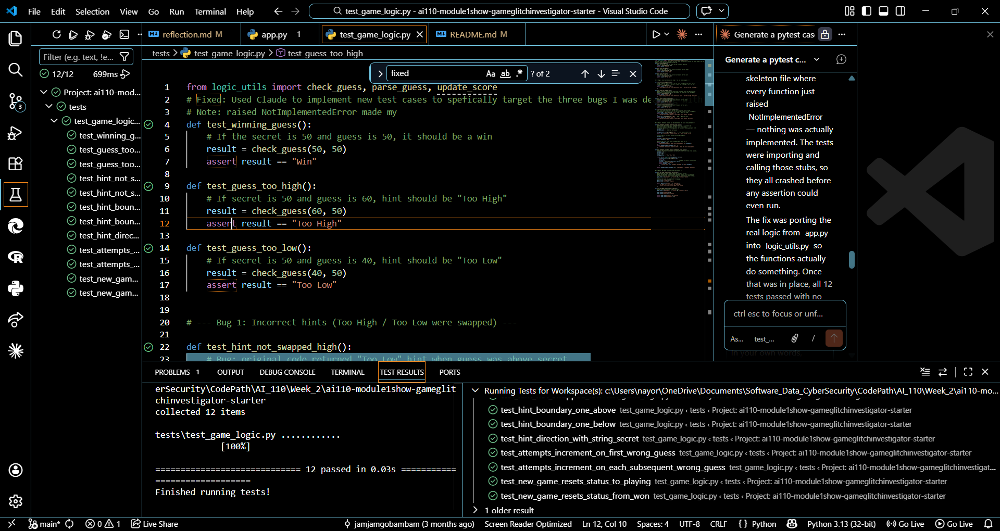
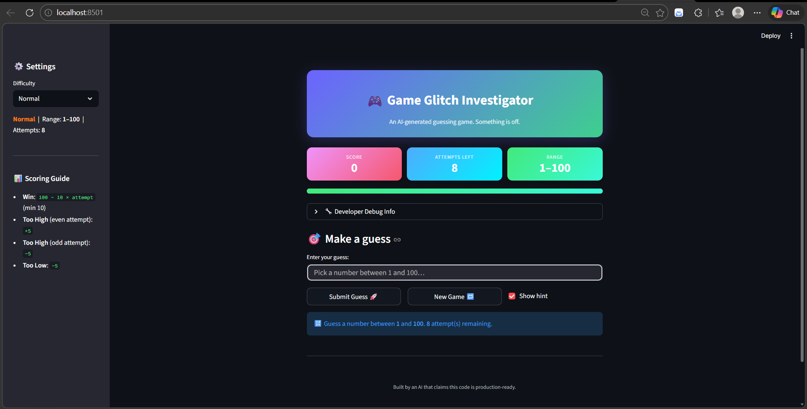

# 🎮 Game Glitch Investigator: The Impossible Guesser

## 🚨 The Situation

You asked an AI to build a simple "Number Guessing Game" using Streamlit.
It wrote the code, ran away, and now the game is unplayable. 

- You can't win.
- The hints lie to you.
- The secret number seems to have commitment issues.

## 🛠️ Setup

1. Install dependencies: `pip install -r requirements.txt`
2. Run the broken app: `python -m streamlit run app.py`

## 🕵️‍♂️ Your Mission

1. **Play the game.** Open the "Developer Debug Info" tab in the app to see the secret number. Try to win.
2. **Find the State Bug.** Why does the secret number change every time you click "Submit"? Ask ChatGPT: *"How do I keep a variable from resetting in Streamlit when I click a button?"*
3. **Fix the Logic.** The hints ("Higher/Lower") are wrong. Fix them.
4. **Refactor & Test.** - Move the logic into `logic_utils.py`.
   - Run `pytest` in your terminal.
   - Keep fixing until all tests pass!

## 📝 Document Your Experience

- [ ] Describe the game's purpose: The purpose is let the user guess a number between certain ranges and it will tell you if it's too high, too low, or correct.
- [ ] Detail which bugs you found: The "New Game" button was not functioning, the secret number was regenerating on every 
interaction instead of remaining fixed, and the attempts counter was not decrementing on the first wrong answer — causing the game to end while attempts were still remaining.

- [ ] Explain what fixes you applied: I used Claude to update the new_game function so that it correctly sets the game state to 
"playing," which resolved the first bug. Next, I identified that the hint logic bug was within the check_guess function and prompted Claude to fix it. Finally, I noticed that attempts_left was not decrementing after the first wrong answer. After consulting Claude, it suggested relocating the function responsible for that logic to execute after the submit function, which resolved the issue.

## 📸 Demo

- [Working Game] []
-[Passing Tests] []

## 🚀 Stretch Features

- [Enhanced UI] []
